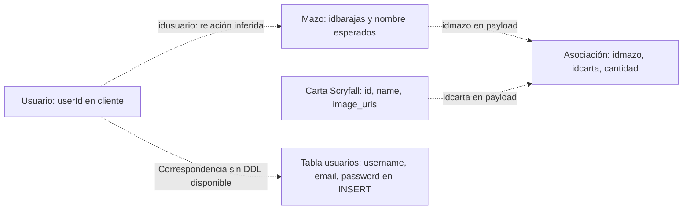

# API y modelo de datos

[Índice](README.md) · Revisión estática: 2026-09-25.

## Alcance de los contratos

Esta version del servidor incluido solo implementa registro.

## Matriz de endpoints

| Método y destino pretendido | Consumidor y activación | Entrada | Respuesta consumida y tratamiento | Servidor incluido |
| --- | --- | --- | --- | --- |
| POST `/login` | [Login](../Alpha%20Ruby/src/screens/loginScreen.tsx), botón iniciar sesión | JSON `{email, password}` | Con `response.ok`, `userId` al contexto y Main; en fallo usa `message` o alerta genérica. | Ausente; URL literal. |
| POST `/register` | [Register](../Alpha%20Ruby/src/screens/registerScreen.tsx), botón registrar | JSON `{nombre, correo, clave}` | Si JSON contiene `error`, alerta; de lo contrario vuelve a Login. No evalúa `response.ok`. | Presente pero exige otros campos; URL literal. |
| GET `/obtener-usuario?userId=…` | [Home](../Alpha%20Ruby/src/screens/homeScreen.tsx), efecto cuando cambia un `userId` válido | Query `userId`; `credentials: 'include'` | `{userName}` con `response.ok`; registra `message` o error en consola. | Ausente; variable sin definir y espacio inicial. |
| GET `/api/barajasdeusuaio2/:userId` | [Gestor](../Alpha%20Ruby/src/screens/DeckManagementScreen.tsx) e [ImageView](../Alpha%20Ruby/src/screens/ImageViewScreen.tsx), al montar | ID del contexto en ruta | Array con `nombre`; gestor genera ID `index + 1`, ImageView usa `idbarajas`. Ambos crean `cards: []`. Fallos en consola. | Ausente; variable sin definir. La errata `deusuaio` está en el código. |
| POST `/api/createmazo2` | [Gestor](../Alpha%20Ruby/src/screens/DeckManagementScreen.tsx), agregar mazo | JSON `{nombre, formato: 'test', descripcion: 'test', idusuario}` | `baraja.id` y `baraja.name`; añade mazo local, limpia campo y cierra modal. Fallo: alerta y posible `error`. | Ausente; URL literal. |
| DELETE `/api/eliminarmazo2/:deckName/:userId` | [Gestor](../Alpha%20Ruby/src/screens/DeckManagementScreen.tsx), eliminar | Nombre e ID en ruta; sin cuerpo ni codificación explícita del nombre | Lee JSON; con `response.ok` elimina del estado todos los mazos cuyo nombre coincide. Alertas de resultado/error. | Ausente; variable sin definir. |
| POST `/api/mazocartas` | [ImageView](../Alpha%20Ruby/src/screens/ImageViewScreen.tsx), elegir mazo | JSON `{idmazo, idcarta, cantidad: 1}` | Con `response.ok`, alerta de éxito; si no, `error` o mensaje genérico. Cierra modal en `finally`. | Ausente; URL literal. |
| GET `/usuario` | [Profile](../Alpha%20Ruby/src/screens/ProfileScreen.tsx), efecto con usuario válido | `credentials: 'include'`; sin ID en query | Objeto con `nombre`, `correo`; fallos en consola. | Ausente; pantalla sin ruta, variable sin definir y espacio inicial. |
| POST `/logout` | [Profile](../Alpha%20Ruby/src/screens/ProfileScreen.tsx), botón cerrar sesión | Sin cuerpo; `credentials: 'include'` | Solo evalúa estado HTTP: si OK limpia contexto y vuelve a Login; si no muestra alerta. | Ausente; pantalla sin ruta, URL literal y espacio inicial. |
| GET `https://api.scryfall.com/cards/search` | [Buscar](../Alpha%20Ruby/src/screens/Buscar.tsx), efecto de texto/filtro | Query `q`, `order`, `dir` | `data.data` para resultados: `id`, `name`, `uri`, `image_uris.small`, `image_uris.art_crop`, `power`, `toughness`. Si falta `data` o hay excepción, lista vacía. No comprueba `response.ok`. | Servicio externo; llamada directa. |
| GET `https://api.scryfall.com/cards/:cardId` | [ImageView](../Alpha%20Ruby/src/screens/ImageViewScreen.tsx), al montar | ID recibido por navegación | Con HTTP OK guarda detalles: `name`, `type_line`, `set_name`, `oracle_text`, `power`, `toughness`. Fallos en consola. | Servicio externo; llamada directa. |

Las escrituras JSON y las lecturas de mazos especifican `Content-Type: application/json`. El uso de `credentials: include` en algunas pantallas expresa una intención de sesión basada en credenciales del navegador; el servidor local no implementa sesiones. No se envía encabezado Authorization en estas llamadas.

## Registro implementado

Fuentes idénticas: [backend/server.js](../Alpha%20Ruby/backend/server.js) y [src/backend/server.js](../Alpha%20Ruby/src/backend/server.js).

Express escucha en el puerto 3000, aplica `cors()` y `bodyParser.json()`, y lee `username`, `email` y `password` del cuerpo. Este es el cuerpo compatible con el handler, como ejemplo documental:

```json
{
  "username": "usuario_ejemplo",
  "email": "ejemplo@example.test",
  "password": "valor_de_ejemplo"
}
```

| Condición | HTTP | Cuerpo |
| --- | --- | --- |
| Algún campo requerido es falsy | 400 | `{"error":"Faltan datos del formulario"}` |
| Error de inserción MySQL | 500 | `{"error":"Error al registrar el usuario"}` |
| Inserción exitosa | 200 | `{"message":"Usuario registrado exitosamente"}` |

La consulta observada es:

```sql
INSERT INTO usuarios (username, email, password) VALUES (?, ?, ?)
```

Los parámetros se pasan separados de la consulta. La contraseña se inserta tal como llega, sin hashing. No hay comprobación de formato de correo ni tratamiento específico de duplicados en el handler; un error de base se devuelve como 500. No hay DDL que permita afirmar restricciones UNIQUE, claves primarias, tipos SQL o longitudes.

El cliente manda `{nombre, correo, clave}`, por lo que, incluso resolviendo su URL, recibiría 400 de este handler. El registro no crea sesión ni devuelve `userId`. Login presupone otro endpoint.

## Consulta de cartas

[Buscar.tsx](../Alpha%20Ruby/src/screens/Buscar.tsx) construye `q` con `encodeURIComponent(searchText)` y sufijos de color, CMC, fuerza, resistencia, lealtad, defensa, legalidad y tipo. Los defaults son `order: 'name'` y `dir: 'auto'`. La existencia de estos fragmentos no significa que todos sus controles UI los actualicen: véanse [flujos](flujos.md) y [limitaciones](limitaciones.md).

El código consume la primera respuesta `data.data` y no sigue `next_page`. Solo permite abrir la imagen de resultados que tengan `image_uris.small`; pasa `art_crop` como imagen grande. No procesa `card_faces`. No se ha consultado ni validado el contrato externo actual de Scryfall: esta sección describe exclusivamente lo que intenta utilizar el cliente.

## Modelo conceptual



| Representación | Campos observados | Límite de interpretación |
| --- | --- | --- |
| Contexto de usuario | `userId: string \| null` | No demuestra el tipo SQL ni una sesión autenticada en el servidor. |
| `Deck` del gestor/editor | `id: number`, `name: string`, `cards?: {id: number, name: string}[]` | El gestor pasa un número al editor; no respeta este objeto esperado. |
| Lista remota de mazos | `nombre`, y en ImageView `idbarajas` | La misma respuesta se transforma de forma distinta según pantalla. |
| Creación de mazo | Entrada `nombre`; salida esperada `baraja.name` | Contrato inferido de cliente sin implementación local. |
| Asociación | `idmazo`, `idcarta` tomado de Scryfall, `cantidad` fijada en 1 | No hay esquema ni lógica de acumulación de cantidad incluida. |
| Carta del editor | ID numérico y nombre | No equivale al objeto completo de Scryfall ni demuestra conversión entre IDs. |

Fuentes: [UserContext](../Alpha%20Ruby/src/screens/UserContext.tsx), [gestor](../Alpha%20Ruby/src/screens/DeckManagementScreen.tsx), [editor](../Alpha%20Ruby/src/screens/deckEditorScreen.tsx), [ImageView](../Alpha%20Ruby/src/screens/ImageViewScreen.tsx) y [SQL de registro](../Alpha%20Ruby/backend/server.js).
