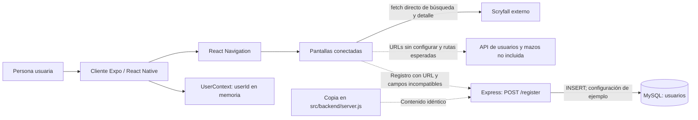
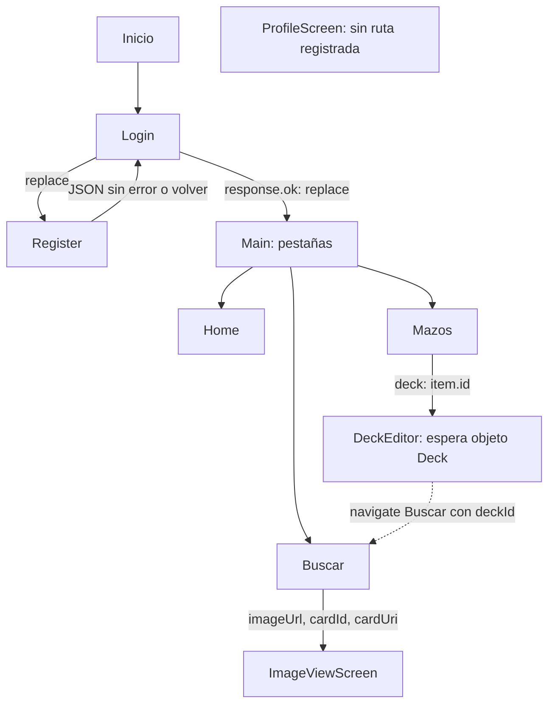

# Arquitectura

[Índice](README.md) · Revisión estática: 2026-09-25.

## Organización del repositorio

La raíz Git es `Alpha-Ruby/`. El paquete de la aplicación está un nivel más abajo, en `Alpha Ruby/`, con un espacio en el nombre. No hay un `package.json` en la raíz Git.

| Área | Responsabilidad y evidencia |
| --- | --- |
| [README raíz](../README.md) y [docs](README.md) | Presentación e información técnica del proyecto. |
| [package.json](../Alpha%20Ruby/package.json) y [package-lock.json](../Alpha%20Ruby/package-lock.json) | Dependencias, scripts y resoluciones del cliente Expo. |
| [App.js](../Alpha%20Ruby/App.js) | Entrada de la aplicación desde Expo; proveedor de usuario, stack y pestañas. |
| [src/screens](../Alpha%20Ruby/src/screens) | Siete pantallas conectadas, una pantalla de perfil sin ruta y un contexto de usuario. |
| [src/RegisterForm.tsx](../Alpha%20Ruby/src/RegisterForm.tsx) | Formulario alternativo sin conexión al navegador principal. |
| [backend](../Alpha%20Ruby/backend) y [src/backend](../Alpha%20Ruby/src/backend) | Dos copias del servidor de registro, cada una con manifiesto y lockfile. Los `server.js` son idénticos al comparar su SHA-256. |
| [respaldos](../Alpha%20Ruby/respaldos) | Versiones anteriores de gestor y editor, no importadas por `App.js`. |
| [src/styles](../Alpha%20Ruby/src/styles) | `stylesLogin.js` y `stylesRegister.js` son importados por sus pantallas. `stylesLanding.js` y `stylesEditorScreen.js` coexisten con estilos locales de Home y editor, sin importarse desde esas pantallas. |
| [assets](../Alpha%20Ruby/assets) | Iconos, splash y favicon referenciados por la configuración Expo. |
| [src/images](../Alpha%20Ruby/src/images) | Fondo del perfil, símbolos de maná SVG, logos e imágenes auxiliares; su presencia no demuestra uso en todas las pantallas. |
| [app.json](../Alpha%20Ruby/app.json) | Nombre y slug `MagicardUCT`, versión 1.0.0, orientación vertical y recursos de plataforma. |
| [babel.config.js](../Alpha%20Ruby/babel.config.js), [tsconfig.json](../Alpha%20Ruby/tsconfig.json) | Preset Babel de Expo y extensión de `expo/tsconfig.base`. |
| [.gitignore](../Alpha%20Ruby/.gitignore) | Excluye dependencias, salidas Expo y otros archivos locales. |
| [apuntes.txt](../Alpha%20Ruby/apuntes.txt) | Notas históricas sobre pantallas, imágenes y ajustes pendientes. |
| [openspec/config.yaml](../openspec/config.yaml), [cambio documental](../openspec/changes/documentar-arquitectura-alpha-ruby/proposal.md), [.agents/skills](../.agents/skills) | Configuración, planificación y skills de OpenSpec; no participan en la ejecución del cliente o servidor. |

## Tecnologías y componentes

El cliente combina JavaScript y TSX. Los rangos declarados en su manifiesto incluyen Expo `~51.0.28`, React `18.2.0`, React Native `0.74.5`, TypeScript `~5.3.3`, React Navigation 6 y React Native Web `~0.19.10`. El navegador utilizado es `@react-navigation/stack`; también se declara `native-stack`, pero `App.js` no lo usa. Los iconos se importan desde FontAwesome y, en Buscar, desde `@expo/vector-icons`.

Ambos [manifiestos backend](../Alpha%20Ruby/backend/package.json) declaran Express `^4.19.2`, MySQL `^2.18.1`, CORS `^2.8.5` y body-parser `^1.20.2`. Estas cifras describen los manifiestos; no son una afirmación de versiones instaladas. Véase [desarrollo](desarrollo.md) para lockfiles y ejecución.

Las líneas continuas representan relaciones o llamadas presentes en el código, no ejecución probada. Las discontinuas señalan integración incompleta o duplicación. MySQL es el destino configurado; no se comprobó una base existente. La API esperada es un límite del análisis, no un servicio encontrado. El backend incluido no intermedia las consultas de Scryfall.

Fuentes: [App.js](../Alpha%20Ruby/App.js), [Buscar](../Alpha%20Ruby/src/screens/Buscar.tsx), [detalle de carta](../Alpha%20Ruby/src/screens/ImageViewScreen.tsx), [servidor](../Alpha%20Ruby/backend/server.js) y [copia](../Alpha%20Ruby/src/backend/server.js).

## Pantallas y navegación

`UserProvider` envuelve `NavigationContainer`. El stack inicia en `Login` y registra `Login`, `Register`, `Main`, `DeckEditor` e `ImageViewScreen`. Main contiene las pestañas `Home`, `Buscar` y `Mazos`. La rama de icono `Settings` no registra una pestaña de ajustes.

| Ruta o módulo | Responsabilidad observada | Estado y datos |
| --- | --- | --- |
| [Login](../Alpha%20Ruby/src/screens/loginScreen.tsx) | Envía credenciales; con `response.ok` asigna usuario y reemplaza por Main; muestra alertas de error. | Email y contraseña locales; `result.userId` al contexto. |
| [Register](../Alpha%20Ruby/src/screens/registerScreen.tsx) | Valida campos no vacíos, envía formulario y vuelve a Login si el JSON no tiene `error`. | Nombre, correo y clave locales; no comprueba `response.ok`. |
| [Home](../Alpha%20Ruby/src/screens/homeScreen.tsx) | Solicita nombre de usuario cuando existe `userId`. | `userName` local; cartas recientes y noticias son textos fijos. |
| [Buscar](../Alpha%20Ruby/src/screens/Buscar.tsx) | Consulta Scryfall, muestra resultados y abre detalle. | Texto, filtros, resultados y carga en memoria. |
| [Mazos](../Alpha%20Ruby/src/screens/DeckManagementScreen.tsx) | Intenta listar, crear y eliminar mazos mediante API propia. | Lista local de respuestas transformadas; no carga cartas del mazo. |
| [DeckEditor](../Alpha%20Ruby/src/screens/deckEditorScreen.tsx) | Edita nombre, elimina cartas del estado y solicita navegación a Buscar. | Espera objeto `Deck`; guardar solo registra en consola y vuelve. |
| [ImageViewScreen](../Alpha%20Ruby/src/screens/ImageViewScreen.tsx) | Muestra imagen/detalle y permite elegir mazo para asociar una carta. | Parámetros `imageUrl`, `cardId`, `cardUri`; lista de mazos y detalles locales. `cardUri` se recibe pero no se usa después. |
| [ProfileScreen](../Alpha%20Ruby/src/screens/ProfileScreen.tsx) | Contiene consulta de perfil y logout. | No está importada ni registrada en App.js; no accesible por sus rutas. |
| [RegisterForm](../Alpha%20Ruby/src/RegisterForm.tsx) | Formulario alternativo que muestra una alerta. | No llama al backend ni está conectado desde App.js. |
| [UserContext](../Alpha%20Ruby/src/screens/UserContext.tsx) | Comparte `userId` y `setUserId`. | No es una pantalla; es estado React en memoria. |

Este mapa combina rutas registradas con transiciones escritas en handlers. La línea discontinua requiere verificación: Buscar es una pestaña anidada y el editor intenta navegar directamente a su nombre desde el stack. Además, Buscar no consume `deckId`. La transición Mazos → DeckEditor pasa un número en lugar del objeto esperado. Por ello el diagrama no garantiza que esos recorridos sean operativos.

Fuentes: [App.js](../Alpha%20Ruby/App.js), [gestor](../Alpha%20Ruby/src/screens/DeckManagementScreen.tsx), [editor](../Alpha%20Ruby/src/screens/deckEditorScreen.tsx) y [Buscar](../Alpha%20Ruby/src/screens/Buscar.tsx).

## Estado y persistencia

La sesión del cliente consiste en `userId: string | null`, inicialmente `null`; no se guarda en disco ni se restaura al reiniciar. No hay token ni guarda condicional de rutas en App.js. ProfileScreen pondría el ID en `null` tras un logout aceptado, pero esa pantalla está desconectada.

La persistencia de usuarios aparece únicamente en el INSERT del servidor de registro. La de mazos y asociaciones es una expectativa del cliente, cuyos endpoints no están en ese servidor. El editor cambia arrays y nombre locales sin guardar remotamente ni propagar cambios al gestor. El gestor genera IDs por índice al listar; ImageView usa `idbarajas`, creando dos interpretaciones de una misma respuesta. Los detalles se recogen en [API y datos](api-y-datos.md) y [limitaciones](limitaciones.md).

Los [respaldos del gestor](../Alpha%20Ruby/respaldos/DeckManagementScreen.tsx) mantienen mazos solo en memoria y pasan el objeto completo al editor. El [editor de respaldo](../Alpha%20Ruby/respaldos/deckEditorScreen.tsx) también trabaja localmente. No son rutas alternativas activas; su import relativo `./UserContext` tampoco corresponde a un archivo dentro de `respaldos/`.
