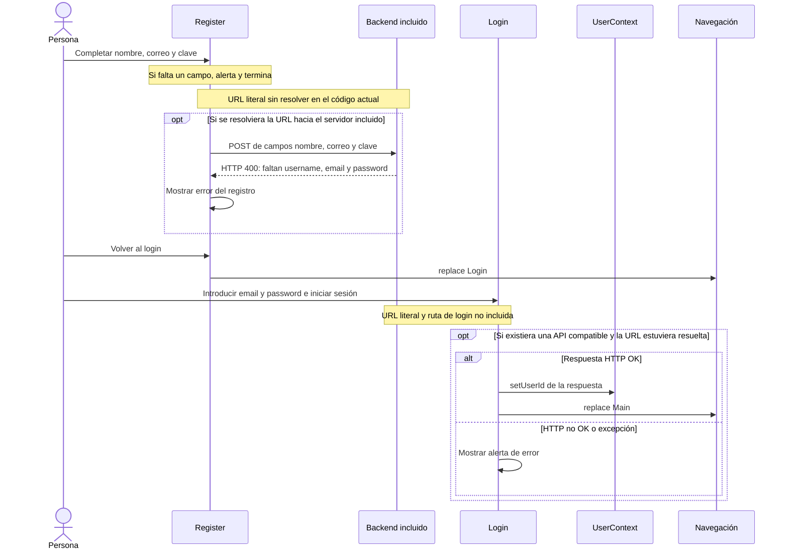

# Flujos de la aplicación

[Índice](README.md) · Revisión estática: 2026-09-25.

Los diagramas representan ramas programadas y contratos esperados. No se ejecutaron estos flujos. Las notas señalan obstáculos y los bloques condicionales evitan presentar como disponible la API faltante. Los endpoints y campos completos se centralizan en [API y datos](api-y-datos.md).

## Registro e inicio de sesión

Register valida que nombre, correo y clave no estén vacíos. Después intenta enviar los campos con nombres en español, incompatibles con el servidor local. Si recibiera un JSON sin `error`, muestra éxito y reemplaza por Login, sin evaluar el estado HTTP. El botón volver también reemplaza por Login.

Login mantiene email/contraseña locales y, si una respuesta fuera HTTP OK, copia `result.userId` al contexto y reemplaza por Main. Si falla HTTP utiliza `result.message`; ante excepción muestra un problema de servidor. No persiste sesión y no comprueba la presencia del ID antes de navegar.



Fuentes: [registerScreen](../Alpha%20Ruby/src/screens/registerScreen.tsx), [loginScreen](../Alpha%20Ruby/src/screens/loginScreen.tsx), [UserContext](../Alpha%20Ruby/src/screens/UserContext.tsx), [App.js](../Alpha%20Ruby/App.js) y [backend](../Alpha%20Ruby/backend/server.js). El bloque condicional explica qué haría el handler con ese payload, sin afirmar que una petición llegue actualmente.

## Búsqueda, detalle y asociación a un mazo

Buscar dispara `fetchCards` desde un efecto dependiente de `searchText` y `filter`. Si el texto está vacío, retorna antes de activar carga. Durante una búsqueda guarda `data.data` o vacía resultados, y desactiva carga en `finally`. La lupa únicamente cambia `searchInitiated` para mostrar resultados; las peticiones ya se disparan al escribir. No hay debounce, cancelación ni paginación.

Al pulsar una carta con imagen se envían `imageUrl`, `cardId` y `cardUri` a ImageViewScreen. Al montar el detalle se invocan las cargas de mazos y detalles sin esperar a que una termine antes de iniciar la otra. El botón «Agregar a mazo» abre el modal; elegir un mazo intenta enviar la asociación con cantidad 1. El modal se cierra después del intento, tanto si hay éxito como si hay error.

```mermaid
sequenceDiagram
  actor U as Persona
  participant B as Buscar
  participant S as Scryfall externo
  participant I as ImageViewScreen
  participant A as API propia esperada
  U->>B: Cambiar texto no vacío
  B->>B: Activar loading
  B->>S: Consultar cartas con texto y filtros conectados
  alt Respuesta JSON con data
    S-->>B: Array esperado de cartas
    B->>B: Guardar resultados
  else Excepción o JSON sin data
    B->>B: Vaciar resultados
  end
  B->>B: Desactivar loading
  U->>B: Pulsar lupa y elegir resultado con imagen
  B->>I: Navegar con imageUrl, cardId y cardUri
  par Carga de mazos
    I-->>A: Intenta consultar mazos del usuario
    Note over I,A: Variable API_BASE_URL sin definir y ruta ausente
  and Carga de detalles
    I->>S: Consultar carta por cardId
    S-->>I: Detalles esperados; se guardan solo con HTTP OK
  end
  U->>I: Abrir selector de mazo
  opt Si existieran mazos cargados
    U->>I: Elegir mazo
    I-->>A: Intenta asociar idmazo e idcarta con cantidad 1
    Note over I,A: URL literal y ruta ausente
    I->>I: Mostrar alerta según resultado
    I->>I: Cerrar modal en finally
  end
```

Fuentes: [Buscar](../Alpha%20Ruby/src/screens/Buscar.tsx) e [ImageViewScreen](../Alpha%20Ruby/src/screens/ImageViewScreen.tsx). Las respuestas de Scryfall son expectativas de código, no disponibilidad verificada. Las flechas discontinuas representan intentos de integración propia bloqueados.

## Gestión y edición de mazos

El gestor intenta cargar mazos una vez al montar. Al crear valida un nombre no vacío y añade al estado el mazo devuelto por la API; al eliminar filtra por nombre después de HTTP OK. No se recarga la lista por cambio de usuario ni por recuperar foco mediante un efecto específico.

La apertura del editor tiene una discrepancia: recibe `deck: item.id` pero lee `deck.name`, `deck.cards` y `deck.id`. Para un ID numérico no nulo, el nombre queda indefinido; llamar a `deckName.trim()` al guardar puede fallar. No se ha ejecutado para observar el error. Incluso con un objeto válido, guardar únicamente escribe en consola y vuelve, y quitar cartas modifica el estado local. No hay petición de persistencia ni devolución del estado al gestor.

El botón añadir carta del editor intenta navegar a Buscar con `deckId`; Buscar no lee ese parámetro. ImageView ofrece su propio selector de mazos. Por lo tanto no hay una continuidad implementada que preseleccione el mazo del editor. Véanse el [mapa de navegación](arquitectura.md) y las [limitaciones](limitaciones.md).

Fuentes: [gestor](../Alpha%20Ruby/src/screens/DeckManagementScreen.tsx), [editor](../Alpha%20Ruby/src/screens/deckEditorScreen.tsx), [Buscar](../Alpha%20Ruby/src/screens/Buscar.tsx).
